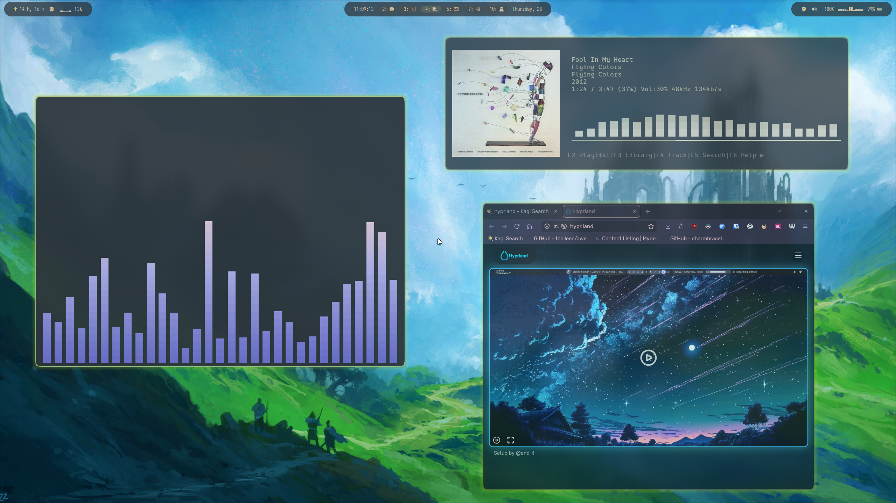

Dotfiles for both windows and linux. Uses bootstrap scripts and symlinks for
setting up the environment.



## Usage

Clone repo and run boostrap script. Note that the W11 version needs admin
to create the symlinks.

``` bash
git clone https://git@github.com/andfroswe/dotfiles ~/.myconf
cd ~/.myconf
./bootstrap.sh
```

If running for Arch, run in terminal before opening Hyprland, otherwise a Hyprland will lose the config until reboot.

Or for windows, do the same but run

``` pswh
./boostrap.ps1
```

## Features

Where possible cross platform apps and services are used.

On windows, does its best to get a decent tiling experience.

On Arch, customizes loads of stuff (wofi, mako, hyprlock etc).

## Dependencies

There are a bunch of stuff that are nice to have to get good customization. Firstly:

### Needed

#### Hypr-stuff and integrations

Hyprland has some nice modules that are needed in this configuration. Download and restart hyprland.

``` bash
yay -S hyprshot hypridle hyprlock hyprpaper clipse dolphin kitty mako wofi mako
```

#### Waybar

To work with Cava plugin, we need to install a special waybar version with Cava support.

Wifi is controlled via NetworkManager and visible via nm-applet. Similarly, PipeWire with WirePlumber uses pavucontrol.

``` bash
yay -S network-manager-applet pavucontrol
```

``` bash
yay -S waybar-cava-git
``` 

### Nice to have

#### App toolkit themes

Colorthemes for apps on Hyprland is notoriously hard to get right, with GTK and Qt toolkits requiring different setup.

Here, I have gone for the Everforest theme. For GTK, install
[Everforest](https://github.com/Fausto-Korpsvart/Everforest-GTK-Theme) with dependencies. Also, the Rubik font looks
relaly nice in applications.

Note that gtk2 uses some python libraries in the project. Install them to the global python distribution and try to
install gtk2 again if that becomes a problem. Also, if pyenv is used, remember to reference that during the install.

``` bash
sudo pacman -S python-setuptools python-gobject --needed
PYENV_VERSION=system yay -S --noconfirm --neded gtk2 gtk-engine-murrine sassc gnome-themes-extra everforest-gtk-theme-git ttf-rubik-vf materia-kde kvantum
```

Note that the installation will take quite some time.

For making settings for GTK, I have found nwg-look to be the simplest. For qt, qt6ct is deprecated so use qt6ct-kde
instead.

``` bash
yay -S nwg-look qt6ct-kde
``` 

Now, open nwg-look (GTK Settings) and select the desired theme. __Important step__ is to go to the Font tab and select
_Font antialiasing_ and select _rgba_ to get proper AA for fonts. 

Then, use qt6ct to set Qt themes.

#### Cursor customization

Cursor customization was easy, following [this](https://blog.nicoandres.dev/change-your-cursor-in-arch-hyprland/) guide.


``` bash
git clone https://gitlab.com/Pummelfisch/future-cyan-hyprcursor.git ~/.config/future-cyan
cp ~/.config/future-cyan/Future-Cyan-Hyprcursor_Theme ~/.local/share/icons/Future-Cyan -r
``` 

The rest is already in the environment part of the dotfiles.
